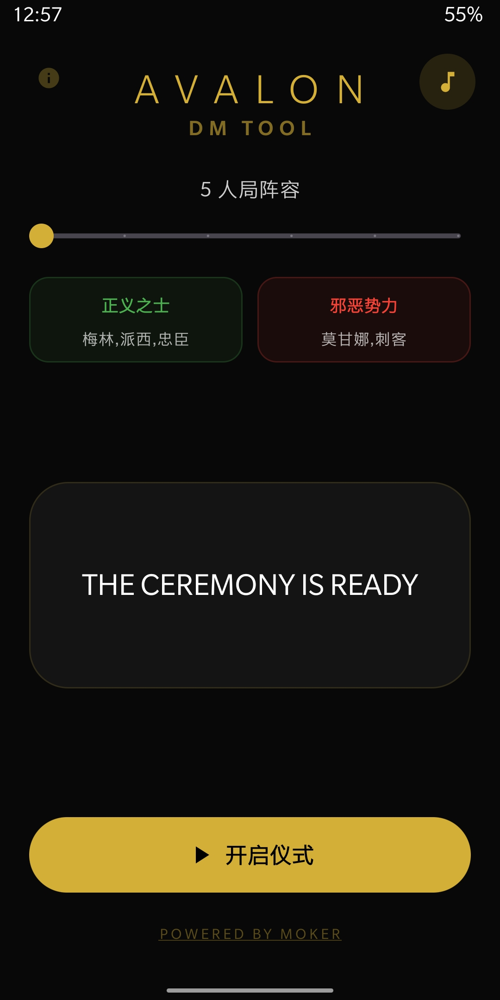

<h1 align="center">DM Tool for Avalon</h1>

<strong>适配阿瓦隆的 DM 语音工具</strong>

Minimalist DM Hosting Assistant for Social Deduction Games

 

Automatically match roles and DM script based on player count. 
根据参与人数自动匹配阵容与完整主持流程。

  

<a href="https://github.com/mokerhao/dm-tool-for-avalon/releases/latest">
  <strong>⬇ Download 下载 ⬇</strong>
</a>

Android · Fully Offline · No Ads 
纯本地运行 · 无广告 · 不收集数据

  

---

# Features 功能特点

<table>
<tr>
<td width="50%" valign="top">

### 🎭 Auto Role Configuration  
自动阵容匹配  

Automatically generates full role setup  
based on selected player count.  

根据参与人数自动生成完整阵容。

</td>

<td width="50%" valign="top">

### 🔊 Script Voice Guidance  
主持词语音播报  

Built-in voice narration  
for smooth and immersive hosting.  

内置语音播报，流程自然顺畅。

</td>
</tr>

<tr>
<td width="50%" valign="top">

### 🎵 Immersive BGM Control  
沉浸式背景音乐  

Long press the music button to  
adjust volume and customize BGM.

长按音乐按钮支持音量调节与自定义音乐。

</td>

<td width="50%" valign="top">

### 🌙 Minimal Dark UI  
极简暗黑界面  

Clean interface designed  
for focus and atmosphere.  

专为主持流程打造的沉浸式界面。

</td>
</tr>
</table>

  

---

# App Preview 应用预览

<table>
<tr>
<td width="50%" align="center">

 
Main Interface 主界面
</td>

<td width="50%" align="center">

 
Role Setup 阵容匹配
</td>
</tr>

<tr>
<td width="50%" align="center">

 
Voice Script 主持播报
</td>

<td width="50%" align="center">

 
BGM Control 音乐控制
</td>
</tr>
</table>

  

---

# Voice Requirement 语音功能说明

This app relies on Android Text-to-Speech (TTS).  
Voice guidance requires a TTS engine enabled.

本应用依赖 Android 系统语音合成（TTS）功能。  
若未启用语音引擎，将无法播放主持词。

 

### International Users

Settings → Accessibility → Text-to-Speech Output →  
Select Google Text-to-Speech Engine

 

### 🇨🇳 国内用户

设置 → 辅助功能 / 无障碍 → 文字转语音 →  
选择并启用语音引擎  

如无语音可安装：  
科大讯飞语音引擎 / Google 文字转语音

  

---

# Privacy

No ads  
No network  
No data collection  

无广告 · 无联网 · 不收集任何信息  

 

---

## © Disclaimer

DM Tool for Avalon is an independent fan-made project.  

This app is not affiliated with, endorsed by, or associated with  
Indie Boards & Cards or the creators of *The Resistance: Avalon*.  

All trademarks and game names belong to their respective owners.

本项目为独立开发的粉丝工具。  

本应用与《The Resistance: Avalon》及其版权方无任何关联或官方授权。  

相关商标与游戏名称归其原版权所有者所有。

 

Designed & Developed by BashanMoker

